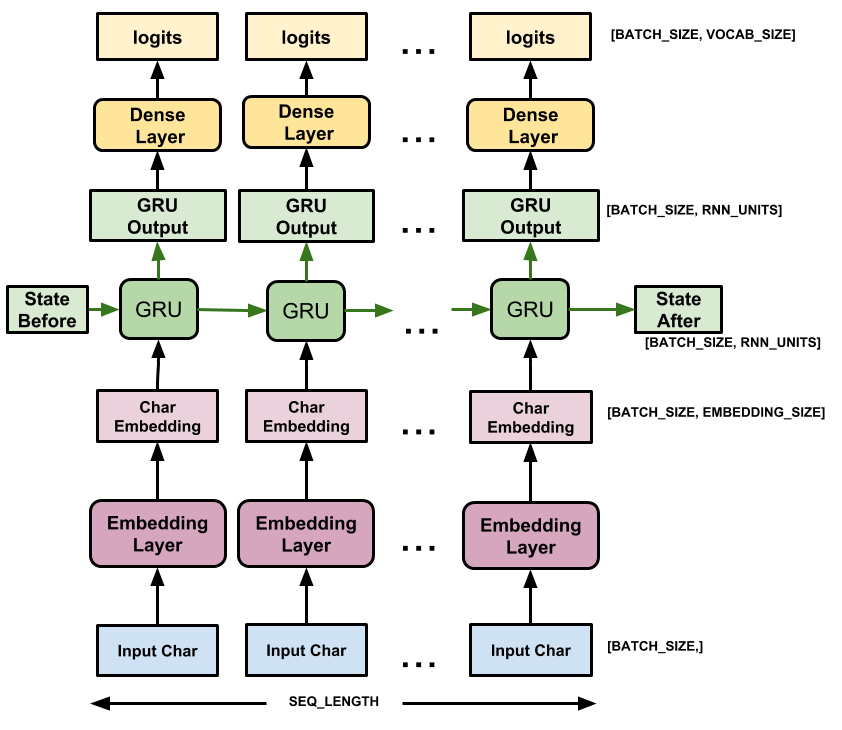

# JielunSong

# 1. 项目架构
* 这是一项使用GRU模型的文本生成任务，文本生成任务是NLP领域最具有挑战性的任务之一，我们将以一段文本或字符为输入，使用模型预测之后可能出现的文本内容，我们希望这些文本内容符合语法并能保持语义连贯性。但是到目前为止，这是一项艰巨的任务，因此从实用角度出发，更多的尝试在与艺术类文本相关的任务中，如我们的当前案例，就是使用莎士比亚的剧本作为原始数据。

## 1.1 结构图

# 2.使用GRU模型实现文本生成任务的步骤¶
* 第一步: 下载数据集并做文本预处理
* 第二步: 构建模型并训练模型
* 第三步: 使用模型生成文本内容

## 2.1 数据集
* 数据集为网络爬取的周杰伦歌曲的数据为7575行周杰伦歌曲语料

## 2.2 生成训练数据
* 训练数据定义
* 对于原始文本，人工定义输入序列长度seq_length，每个输入序列与其对应的目标序列等长度，但是向右顺移一个字符。

# 3.生成周杰伦风格歌曲

